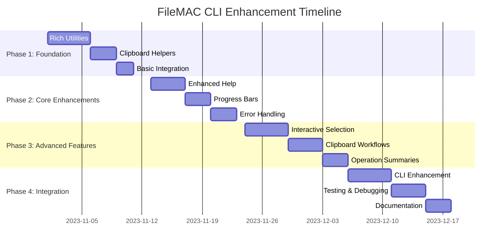

# FileMAC CLI Enhancement Plan

## Overview

This document outlines the comprehensive plan to enhance FileMAC's command-line interface using Rich and pyperclip libraries to create a more robust, user-friendly experience.

## Current State Analysis

### Strengths
- ✅ Rich library already integrated for progress bars
- ✅ Pyperclip available in environment
- ✅ Existing color support via custom utilities
- ✅ Comprehensive functionality across 40+ commands
- ✅ Well-structured operation mapping system

### Opportunities for Improvement
- ❌ Basic argparse interface could be more user-friendly
- ❌ Text-based help lacks visual appeal
- ❌ Limited interactive elements
- ❌ No clipboard integration
- ❌ Inconsistent progress feedback

## Enhancement Strategy

### Phase 1: Foundation (Week 1-2)

**Objective**: Establish core utilities and infrastructure

**Tasks**:
1. **Create Rich Console Wrapper** (`filemac/utils/rich_utils.py`)
   - Custom theme matching existing color scheme
   - Standardized message formats (info, success, error, warning)
   - Console initialization and configuration

2. **Implement Clipboard Utilities** (`filemac/utils/clipboard.py`)
   - `copy_to_clipboard()` function
   - `paste_from_clipboard()` function
   - Error handling for clipboard operations

3. **Basic Rich Integration**
   - Replace `print()` statements with Rich console methods
   - Add color consistency across modules
   - Create standard message formats

### Phase 2: Core Enhancements (Week 3-4)

**Objective**: Enhance core CLI functionality with Rich features

**Tasks**:
1. **Enhanced Help System** (`filemac/cli/help.py`)
   - Rich-formatted command tables
   - Categorized command display
   - Interactive help navigation

2. **Progress Bars for All Operations** (`filemac/utils/progress.py`)
   - Standardized progress bar creation
   - Consistent styling across modules
   - Time estimates and completion percentages

3. **Enhanced Error Handling** (Enhance `filemac/core/exceptions.py`)
   - Rich-formatted error panels
   - Contextual error information
   - Suggested solutions and troubleshooting

### Phase 3: Advanced Features (Week 5-6)

**Objective**: Add interactive elements and workflow improvements

**Tasks**:
1. **Interactive File Selection** (`filemac/cli/interactive.py`)
   - Visual file listing with tables
   - Multi-file selection interface
   - File preview capabilities

2. **Clipboard Workflow Integration** (`filemac/cli/clipboard_workflows.py`)
   - Clipboard-based input workflows
   - Result copying to clipboard
   - Batch operation support

3. **Operation Summary Display** (`filemac/cli/summary.py`)
   - Visual operation summaries
   - Success/error breakdowns
   - Clipboard copy options

### Phase 4: Integration (Week 7)

**Objective**: Full integration with existing CLI

**Tasks**:
1. **Enhanced CLI Entry Point** (Modify `filemac/cli/cli.py`)
   - Rich welcome message
   - Clipboard support flag
   - Enhanced argument parsing

2. **Operation Mapper Enhancement** (Extend `OperationMapper`)
   - Rich progress display
   - Clipboard integration
   - Enhanced completion messages

## Implementation Details

### Rich Utilities Implementation

```python
# filemac/utils/rich_utils.py
from rich.console import Console
from rich.theme import Theme

custom_theme = Theme({
    "info": "cyan",
    "warning": "yellow", 
    "error": "bold red",
    "success": "bold green",
    "debug": "magenta",
    "prompt": "bold blue"
})

console = Console(theme=custom_theme)

def print_info(message):
    console.print(f"[info]ℹ {message}[/info]")

def print_success(message):
    console.print(f"[success]✓ {message}[/success]")

def print_error(message):
    console.print(f"[error]❌ {message}[/error]")

def print_warning(message):
    console.print(f"[warning]⚠ {message}[/warning]")
```

### Clipboard Utilities Implementation

```python
# filemac/utils/clipboard.py
import pyperclip
from .rich_utils import console, print_success, print_error

def copy_to_clipboard(text):
    """Copy text to system clipboard"""
    try:
        pyperclip.copy(text)
        print_success("Copied to clipboard!")
        return True
    except Exception as e:
        print_error(f"Failed to copy to clipboard: {str(e)}")
        return False

def paste_from_clipboard():
    """Get text from system clipboard"""
    try:
        content = pyperclip.paste()
        return content if content else None
    except Exception as e:
        print_error(f"Failed to access clipboard: {str(e)}")
        return None
```

### Enhanced Help System

```python
# filemac/cli/help.py
from rich.panel import Panel
from rich.table import Table
from rich.box import ROUNDED
from .rich_utils import console

def show_main_help():
    """Display enhanced help with Rich formatting"""
    table = Table(
        title="📁 FileMAC Commands",
        show_header=True,
        header_style="bold magenta",
        box=ROUNDED,
        border_style="blue"
    )
    
    table.add_column("Command", style="cyan", no_wrap=True)
    table.add_column("Description", style="white")
    table.add_column("Example", style="green")
    
    commands = [
        ("--convert_doc", "Convert documents between formats", "filemac --convert_doc file.docx -to pdf"),
        ("--convert_audio", "Convert audio files", "filemac --convert_audio file.mp3 -to wav"),
        # ... more commands
    ]
    
    for cmd, desc, example in commands:
        table.add_row(cmd, desc, example)
    
    panel = Panel.fit(
        table,
        title="[bold]FileMAC Help System[/bold]",
        border_style="blue",
        subtitle="Advanced file conversion toolkit"
    )
    
    console.print(panel)
```

## Migration Strategy

### Backward Compatibility
- ✅ Keep all existing command-line arguments
- ✅ Maintain current functionality
- ✅ Add new features as optional flags
- ✅ Preserve existing workflows

### Gradual Rollout Plan
1. **Week 1-2**: Foundation utilities
2. **Week 3-4**: Core Rich enhancements
3. **Week 5-6**: Advanced interactive features
4. **Week 7**: Full integration and testing

### Risk Assessment

**Low Risk**:
- Rich already in dependencies
- Gradual migration approach
- Backward compatibility maintained

**Medium Risk**:
- User adaptation to new UI
- Clipboard permissions on some systems
- Performance impact of Rich rendering

**Mitigation**:
- Provide fallback to text mode
- Add configuration options
- Comprehensive error handling
- User education

## Benefits Realization

### Immediate Benefits
- ✅ Better visual feedback for users
- ✅ Professional, modern CLI appearance
- ✅ Consistent color scheme and formatting
- ✅ Enhanced error messages with context

### Medium-Term Benefits
- ✅ Faster workflows with clipboard integration
- ✅ Better user experience with progress indicators
- ✅ Interactive file selection and processing
- ✅ Visual operation summaries

### Long-Term Benefits
- ✅ Foundation for advanced CLI features
- ✅ Improved user adoption and satisfaction
- ✅ Competitive advantage in CLI tools
- ✅ Easier maintenance and extension

## Testing Approach

### Unit Testing
- Test Rich utilities in isolation
- Verify clipboard functionality
- Validate progress bar behavior

### Integration Testing
- Test with existing CLI commands
- Verify backward compatibility
- Check error handling

### User Testing
- Gather feedback on new UI
- Test interactive workflows
- Validate clipboard integration

### Performance Testing
- Measure Rich rendering impact
- Test with large file operations
- Validate progress bar performance

## Documentation Requirements

### Updated Documentation
- ✅ README.md with Rich features
- ✅ Examples of new clipboard workflows
- ✅ Visual guides for enhanced UI
- ✅ Updated help system documentation

### User Education
- ✅ Migration guide for existing users
- ✅ New feature tutorials
- ✅ Best practices for Rich CLI usage
- ✅ Troubleshooting guide

## Implementation Timeline



## Success Metrics

### Quantitative Metrics
- ✅ Reduction in user errors
- ✅ Increase in command usage
- ✅ Faster operation completion times
- ✅ Higher user satisfaction scores

### Qualitative Metrics
- ✅ Positive user feedback
- ✅ Increased feature adoption
- ✅ Improved documentation clarity
- ✅ Enhanced professional appearance

## Conclusion

This enhancement plan provides a clear, low-risk path to transform FileMAC's CLI from functional to exceptional. By leveraging existing Rich integration and adding strategic pyperclip functionality, we can significantly improve user experience and productivity while maintaining all existing functionality.

The gradual migration approach ensures minimal disruption and allows for continuous feedback and improvement throughout the process.

**Next Steps**:
1. Implement Phase 1 foundation utilities
2. Begin gradual integration with existing modules
3. Test thoroughly and gather user feedback
4. Proceed through phases as planned
5. Document and communicate changes effectively